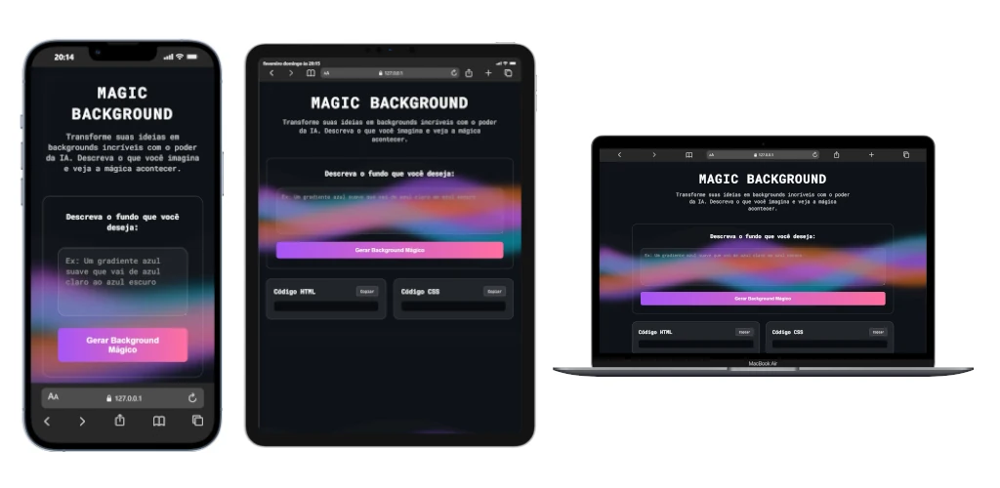
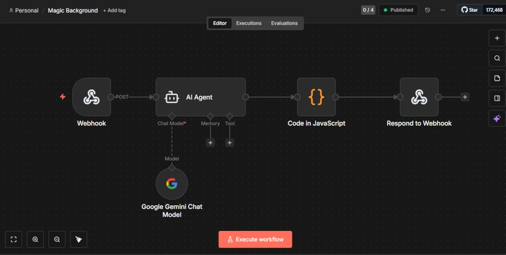

# ✨ Magic Background

> ⚠️ **ATENÇÃO:** Este projeto depende de um ambiente n8n ativo (pago) para funcionar completamente. Sem um workflow n8n configurado e em execução, a geração de backgrounds não será processada.

Uma aplicação web interativa que utiliza Inteligência Artificial para transformar descrições textuais em códigos CSS e HTML de backgrounds prontos para uso. Simplifique seu processo criativo gerando fundos visuais únicos instantaneamente com preview em tempo real.

[](https://magic-background.vercel.app/)

---

## 🧐 Sobre o Projeto

O **Magic Background** é uma ferramenta front-end desenvolvida para otimizar o fluxo de trabalho de designers e desenvolvedores. A aplicação atua como uma interface cliente moderna que consome serviços de automação **n8n** para converter linguagem natural em código visual.

O objetivo é abstrair a complexidade da criação de estilos CSS avançados, permitindo que o usuário foque na intenção criativa. Através de uma arquitetura limpa e reativa, o sistema gerencia a comunicação com o backend, trata os estados da aplicação e renderiza os resultados dinamicamente no DOM.

---

## ✨ Funcionalidades Principais

- **Geração via Prompt:** Input de texto intuitivo para descrever o background desejado.
- **Renderização Dinâmica:** O código recebido é injetado automaticamente na página para um preview fiel e imediato.
- **Gestão de Feedback:** Indicadores visuais de carregamento ("loading states") e tratamento de erros de requisição para melhor UX.
- **Exportação de Código:** Botões dedicados com funcionalidade de "Copiar para a Área de Transferência" para HTML e CSS separadamente.
- **Interface Responsiva:** Layout adaptável construído com CSS moderno (Flexbox/Grid).

---

## 🛠️ Tecnologias e Métodos

- **HTML5 Semântico:** Para melhor acessibilidade e SEO.
- **CSS3:** Com uso de variáveis e reset CSS.
- **JavaScript Vanilla:** Lógica de controle assíncrono (`async/await`), manipulação do DOM e Event Listeners sem dependência de frameworks.
- **Fetch API:** Para comunicação RESTful com o backend.
- **n8n (Automação de Workflow):** Integração via Webhook para processamento inteligente das descrições com o modelo de IA **Google Gemini**.



---

## 🌐 Arquitetura da Aplicação

A aplicação segue um padrão de comunicação cliente-servidor simples e eficiente:

1. **Frontend:** Coleta a descrição textual do usuário.
2. **Integração (n8n):** O frontend dispara uma requisição `POST` para um webhook hospedado no **n8n.cloud**.
3. **Processamento:** O n8n processa a solicitação integrando o modelo de IA **Google Gemini** para interpretar a descrição e gerar o código CSS e HTML correspondente.
4. **Resposta:** O backend retorna um objeto JSON com os fragmentos de código prontos para uso:

```json
{
  "html": "<div>...</div>",
  "css": ".classe { ... }"
}
```

O JavaScript do cliente então injeta o CSS em uma tag `<style>` dinâmica para aplicar o visual instantaneamente.

---

## 🚀 Como Executar

Este projeto não requer instalação de dependências ou processos de build (como npm ou webpack), pois utiliza tecnologias web nativas.

**Pré-requisitos:**

- Conta ativa no [n8n.cloud](https://n8n.io) com o workflow configurado e em execução
- Chave de API do [Google Gemini](https://aistudio.google.com/)

1. **Clone o repositório:**

   ```bash
   git clone https://github.com/seu-usuario/projeto-fundomagico.git
   ```

2. **Acesse a pasta do projeto:**

   ```bash
   cd projeto-fundomagico
   ```

3. **Configure as variáveis de ambiente:**

   Crie um arquivo `.env` na raiz do projeto com o seguinte conteúdo:

   ```env
   N8N_WEBHOOK_URL=sua-url-do-webhook-n8n
   ```

4. **Abra o projeto:**
   - Basta abrir o arquivo `index.html` em qualquer navegador moderno.
   - **Dica:** Para evitar bloqueios de segurança (CORS), recomenda-se usar a extensão **Live Server** no VS Code.

---

Desenvolvido com 💜 e código.
